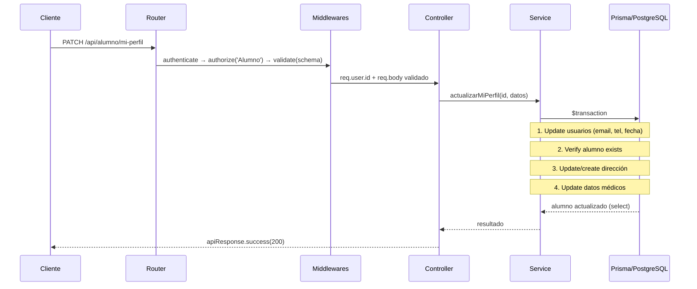

# Feature: Alumnos — Documentación Técnica

Gestión del perfil de alumno autenticado. Permite al alumno actualizar sus datos personales, médicos y de dirección.

---

## Estructura de Archivos

```text
src/features/alumnos/
├── alumno.routes.js       # Endpoints y middlewares
├── alumno.controller.js   # Manejo Request/Response (catchAsync)
├── alumno.service.js      # Lógica de negocio + Prisma
└── alumno.schema.js       # Schema Zod para validación de body
```

---

## Modelo de Datos

```mermaid
erDiagram
    usuarios ||--o| alumnos : "si rol=alumno"
    alumnos |o--o| direcciones : "vive en"
    alumnos ||--o{ alumnos_contactos : "emergencia"

    alumnos {
        int usuario_id PK_FK
        int direccion_id FK
        string condiciones_medicas
        string seguro_medico
        string grupo_sanguineo
    }

    direcciones {
        int id PK
        string direccion_completa
        string distrito
        string ciudad
        string referencia
    }
```

---

## Endpoints

| Método | Ruta | Auth | Descripción |
|--------|------|------|-------------|
| `PATCH` | `/api/alumno/mi-perfil` | `Alumno` | Actualizar perfil del alumno autenticado |

---

## Flujo de Datos



---

## Schema Zod (`alumno.schema.js`)

| Schema | Uso | Qué valida |
|--------|-----|------------|
| `actualizarPerfilSchema` | `PATCH /mi-perfil` | Todos los campos opcionales: email, teléfono, fecha nacimiento, datos médicos, dirección. `.strict()` rechaza campos desconocidos. |

---

## Service (`alumno.service.js`)

### `actualizarMiPerfil` — Update multi-tabla con Transacción

Transacción que actualiza selectivamente:
- **Tabla `usuarios`**: email, teléfono, fecha de nacimiento
- **Tabla `direcciones`**: crear nueva o actualizar existente
- **Tabla `alumnos`**: condiciones médicas, seguro, grupo sanguíneo

Usa `select` explícito (§3.2) en el return para devolver solo los datos necesarios. Lanza `ApiError(404)` si el alumno no existe.

---

## Cadena de Middlewares

| Ruta | Cadena |
|------|--------|
| `PATCH /mi-perfil` | `authenticate` → `authorize('Alumno')` → `validate(actualizarPerfilSchema)` → controller |
