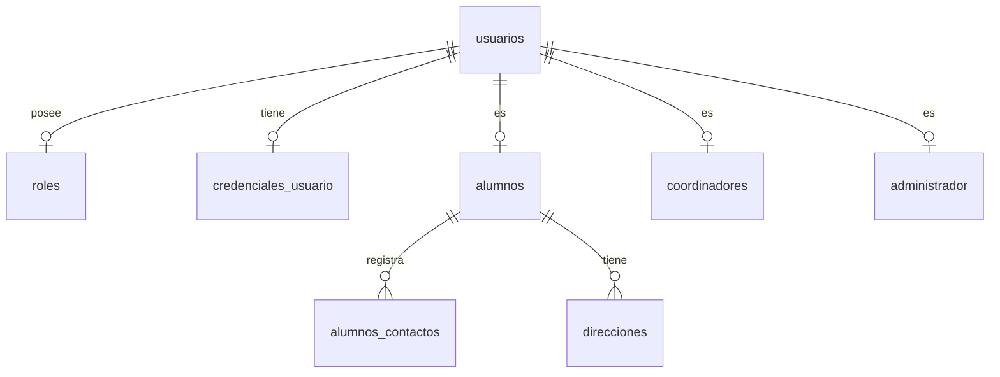
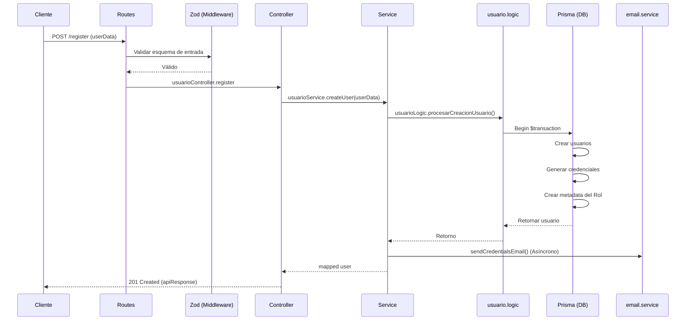

# Feature: Usuarios

Módulo encargado de la gestión de usuarios, perfiles (alumnos, administradores, coordinadores), roles y estadísticas relacionadas.

## 1. Estructura de Archivos y Responsabilidades
```text
src/features/usuarios/
├── usuario.routes.js       # Definición de endpoints y enrutamiento.
├── usuario.controller.js   # Manejo de requests/responses HTTP y formateo con apiResponse.
├── usuario.service.js      # Lógica transaccional simple y delegación a capa logic.
├── usuario.schema.js       # Exporta esquemas Zod unificados del feature.
├── logic/
│   ├── usuario.logic.js    # Lógica de negocio core para la creación y actualización.
│   └── registro.logic.js   # Lógica interna auxiliar para generación de credenciales y datos.
├── schemas/
│   ├── common.schema.js    # Esquemas Zod compartidos de usuario.
│   ├── roles.schema.js     # Esquemas Zod específicos por rol.
│   ├── register.schema.js  # Esquema Zod de creación unificada de usuario.
│   └── update.schema.js    # Esquema Zod de actualización de perfil.
├── services/
│   ├── dashboard.service.js# Lógica de extracción de estadísticas.
│   ├── reporte.service.js  # Lógica de reportabilidad en Excel.
│   └── cumpleanos.service.js# Servicio de felicitación de cumpleaños por medios externos.
└── validators/
    └── usuario.validator.js# Funciones utilitarias imperativas para validación de roles.
```

## 2. Modelo de Datos


## 3. Endpoints y Cadena de Middlewares
| Método | Ruta | Middlewares | Descripción |
|---|---|---|---|
| POST | `/register` | `validate(registerUserSchema)` | Registra un nuevo usuario en la plataforma. |
| POST | `/validate-role` | `validate(validateRoleSchema)` | Valida que el payload para un rol sea correcto. |
| GET | `/dni/:dni` | `authenticate`, `authorize('Administrador', 'Coordinador')` | Obtiene un usuario por su DNI. |
| GET | `/:id` | `authenticate`, `authorize('Coordinador', 'Administrador', 'Alumno')`, `validateParams(idParamSchema)` | Obtiene el perfil completo de un usuario por ID. |
| GET | `/role/:rol` | `validateParams(rolParamSchema)` | Obtiene la lista de usuarios agrupados por rol dado. |
| GET | `/count/usuarios-stats` | `authenticate`, `authorize('Administrador')` | Kpis y métricas para el dashboard de administración. |
| PUT | `/:id` | `authenticate`, `validateParams(idParamSchema)`, `validate(updateUserSchema)` | Actualiza un perfil dado. |
| GET | `/reporte/detallado` | `authenticate`, `authorize('Administrador')` | Genera los datos para el reporte en Excel de alumnos. |

## 4. Flujo de Datos (Creación de Usuario)


## 5. Schemas Zod Estructurales
- **registerUserSchema**: Valida los datos base de usuarios de forma robusta y emplea `.superRefine` transversalmente contra los modulos en `roles.schema.js`.
- **updateUserSchema**: Valida los campos de actualización garantizando pre-condiciones como "al menos 1 campo enviado".

## 6. Service y Logic Detallado
- **usuario.service.js**: Expone métodos simplificados y mapea hacia servicios especialistas.
- **usuarioLogic.procesarCreacionUsuario**: Función central. Gestiona la transacción principal. Normaliza roles, revisa existencia de credenciales y delega la creación del rol específico.
- **usuarioLogic.procesarActualizacionPerfilAlumno**: Upserts complejos sobre la entidad del alumno, gestionando actualizaciones atómicas sobre datos médicos, relacionales y contacto.
- **cumpleanosService.ejecutarSaludosCumpleanos**: Función cron o manual. Extrae de DB usuarios en su día y procesa notificaciones en lotes usando `p-limit` para regular el I/O por WhatsApp y Email.
